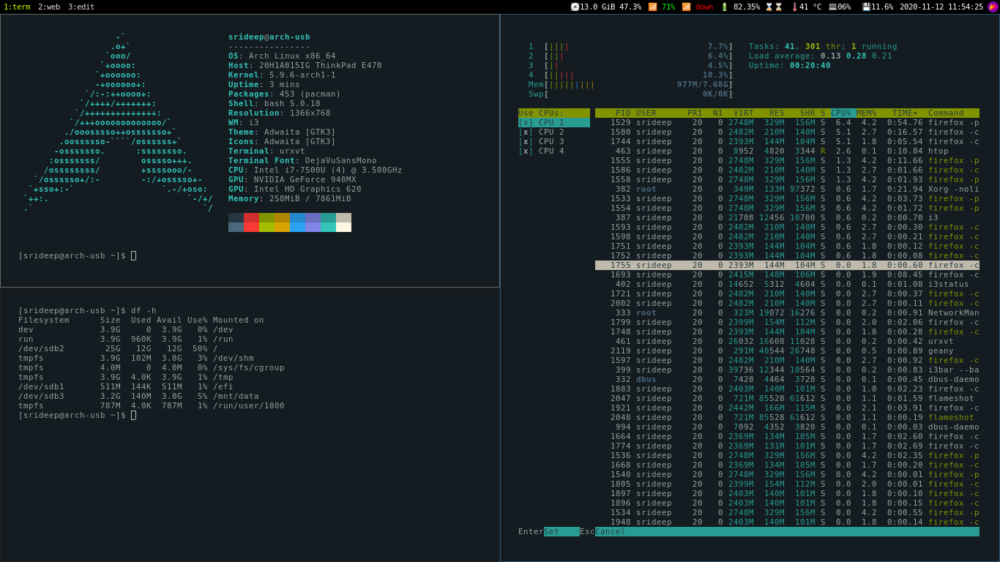

# arch_i3_01
Set of applications and configurations to get a nice looking Arch + i3wm Setup

### Screenshot


### Nano
To enable the inbuilt syntax highlighting

```
find /usr/share/nano/ -iname "*.nanorc" -exec echo include {} \; >> ~/.nanorc
```
